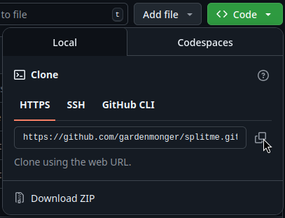
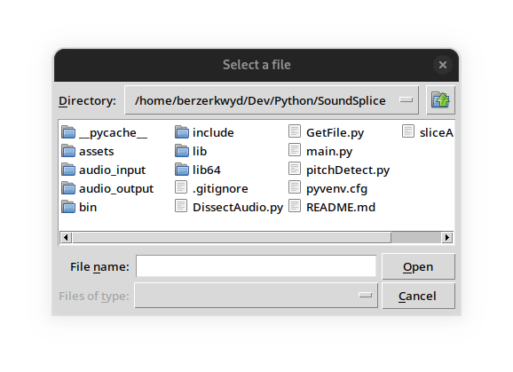
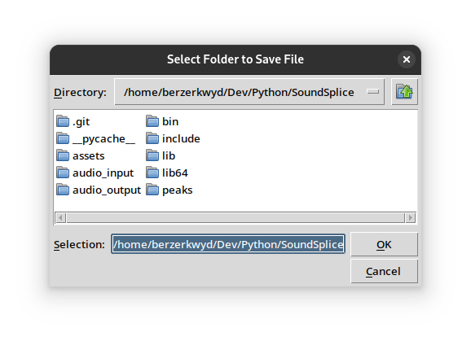
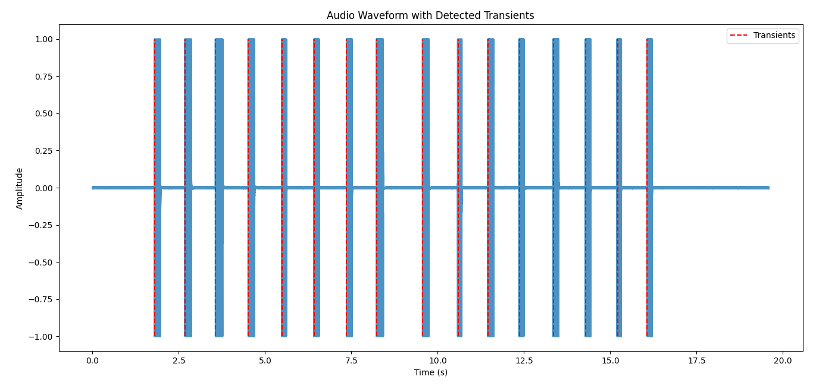

<h1>Audio Splitter</h1>
<h3>splits an audio stream and lables each sample with corresponding musical notes</h3>
<h4>the notes are not entirely accurate ... but still working on that part</h4>

#[] clone repository

#[] enable python environment `python -m venv to/repo/`

#[] from terminal cd into dir 

#[] run `pip install librosa`

#[] run `pip install -r requirements.txt`

#[] double check to see that `requirement.txt` is installed 

#[] run `python main.py`

#[] select which audio you want to use 

#[] select the output you want the audio to be 

#[] preview the audio wave form 

adjust parameters for different samples

